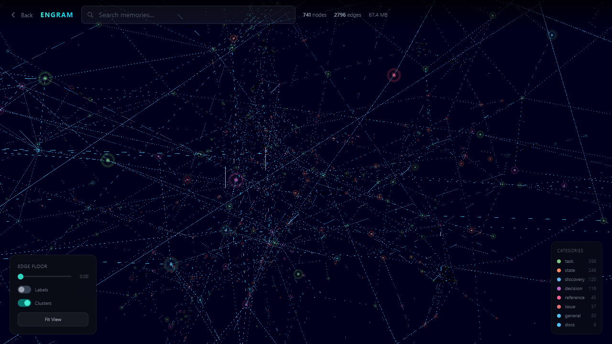

<div align="center">

# Engram

**The cognitive layer for AI agents.**

Memory, personality, reasoning, and trust in a single self-hosted system that learns, forgets, and grows.

[](CHANGELOG.md) [](LICENSE) [](https://nodejs.org) [](docker-compose.yml)

</div>

<div align="center">

[Quick Start](#quick-start) · [Features](#what-engram-does) · [Architecture](#architecture) · [API](#api-reference) · [CLI](#cli) · [SDK](#typescript-sdk) · [MCP](#mcp-server) · [Deploy](#deployment)

</div>

---




---

## What Engram Does

### Memory

FSRS-6 spaced repetition with power-law forgetting. Hybrid search fuses vector similarity, full-text matching, personality signals, and graph traversal into a single ranked result. Memories strengthen when accessed and fade when ignored.

### Personality

Extracts preferences, values, motivations, decisions, emotions, and identity markers from conversations. Synthesized personality profiles are automatically injected into `/recall` and `/context` responses, so every agent interaction is personality-aware without configuration.

### Reasoning

Detects contradictions between stored facts. Generates reflections. Derives new knowledge from existing records. Time-travel queries let you ask "what did I know on March 1st?" Smart context assembles the right information for the right moment.

### Trust

Execution signing, guardrails, trust scoring, and full audit trails. Every record has provenance. Every action can be verified.

### Orchestration (v6.0.0 - Syntheos)

Seven standalone microservices absorbed into Engram as native modules. Agent registry (Soma), task tracking (Chiasm), event bus (Axon), workflow orchestration (Loom), quality evaluation (Thymus), action logging (Broca), and structural analysis (OpenSpace). Same database, same auth, zero new dependencies.

### Bulk Ingestion

The `/ingest` endpoint accepts large document uploads and processes them through a full pipeline: format detection, parsing, chunking, and memory creation. Supports markdown, HTML, PDF, DOCX, CSV, JSONL, ZIP archives, and conversation exports from Claude and ChatGPT. Two modes: `raw` stores chunks directly, `extract` runs LLM fact extraction on each chunk. Progress is streamed via Axon events and tracked as a Chiasm task.

### Eidolon (Companion Intelligence Layer)

[Eidolon](https://codeberg.org/GhostFrame/eidolon) pairs with Engram to add proactive agent awareness. Action gating blocks dangerous operations before they execute. A living prompt injects relevant memory context into every agent session. Credential scrubbing prevents secrets from leaking into prompts. Engram is the memory. Eidolon is the guardian that acts on it.

---

### Recent Changes

**Modular server refactor** - The monolithic `routes/index.ts` has been decomposed into domain modules (`memory/`, `search/`, `ingestion/`, `admin/`, `auth/`, etc.) with a shared router. Each module owns its routes, types, and logic. The single-file entrypoint still works for backwards compatibility.

**Embedding and reranker model swap** - Embeddings moved from gte-Qwen2-1.5B-instruct to [BAAI/bge-m3](https://huggingface.co/BAAI/bge-m3) (1024-dim, SentencePiece Unigram tokenizer). Reranker moved from bge-reranker-base to [IBM granite-embedding-reranker-english-r2](https://huggingface.co/ibm-granite/granite-embedding-reranker-english-r2) (ByteLevel BPE tokenizer, INT8 quantized). Both run as ONNX models in dedicated Worker threads and are drop-in replaceable via `ENGRAM_MODEL_DIR` and `ENGRAM_RERANKER_MODEL_DIR`.

---

## Quick Start

```bash
# Docker (recommended)
git clone https://codeberg.org/GhostFrame/engram.git && cd engram
git config core.hooksPath .githooks  # enable pre-commit safety checks
cp .env.example .env  # set ENGRAM_GUI_PASSWORD
docker compose up -d

# Or run directly (Node 22+)
npm install
node --experimental-strip-types server-split.ts
```

Create an API key, then store and search:

```bash
# Bootstrap admin key (save the returned key)
curl -X POST http://localhost:4200/bootstrap \
  -H "Content-Type: application/json" \
  -d '{"name": "admin"}'

# Store a memory
curl -X POST http://localhost:4200/store \
  -H "Authorization: Bearer eg_YOUR_KEY" \
  -H "Content-Type: application/json" \
  -d '{"content": "Production DB is PostgreSQL 16 on db.example.com:5432", "category": "reference"}'

# Search with natural language
curl -X POST http://localhost:4200/search \
  -H "Authorization: Bearer eg_YOUR_KEY" \
  -H "Content-Type: application/json" \
  -d '{"query": "database connection info"}'
```

---

## Features

- **[4-channel hybrid search](#architecture):** Reciprocal Rank Fusion across vector, full-text, personality, and graph signals
- **[Knowledge graph](#architecture):** Auto-linking, community detection, PageRank, 2-hop traversal
- **[Spaced repetition](#architecture):** FSRS-6 with power-law forgetting and dual-strength memory model
- **[Personality engine](#architecture):** Preferences, values, motivations, decisions, emotions, identity
- **[Guardrails](#api-reference):** Pre-action safety checks against stored rules (allow, warn, block)
- **[MCP server](#mcp-server):** 25+ tools for Claude Desktop, Cursor, Windsurf, and other MCP clients
- **[TypeScript SDK](#typescript-sdk):** First-class client with store, search, context, guard, inbox
- **[CLI](#cli):** Zero-dependency command-line interface for scripting and shell use
- **[Graph visualization](#deployment):** WebGL force graph for exploring memory space
- **[Multi-tenant](#configuration):** Isolated memory per user with API key auth
- **[One-command deploy](#deployment):** docker compose up -d

---

<a id="architecture"></a>
<details>
<summary><strong>Architecture</strong></summary>

### Runtime Stack

- Server: Node.js 22+ with `--experimental-strip-types` (or Bun)
- Database: libsql (SQLite fork with native FLOAT32 vector columns and FTS5)
- Embeddings: BAAI/bge-m3, 1024-dim, local ONNX inference in a Worker thread (swappable via `ENGRAM_MODEL_DIR`)
- Reranker: IBM granite-embedding-reranker-english-r2 INT8 quantized cross-encoder (optional, swappable via `ENGRAM_RERANKER_MODEL_DIR`)
- Decay: FSRS-6 with 21 trained parameters and power-law forgetting
- LLM: optional, any OpenAI-compatible endpoint (fact extraction, personality, consolidation)

### Search Pipeline

Every query runs through four parallel channels, then merges via Reciprocal Rank Fusion:

1. Vector similarity: cosine distance against bge-m3 embeddings
2. FTS5 full-text: BM25 ranking across content and tags
3. Personality signals: match against extracted preferences, values, and identity markers
4. Graph relationships: 2-hop traversal weighted by edge type and PageRank score

Question-type detection (fact recall, preference, reasoning, generalization, timeline) adapts channel weights before scoring. The cross-encoder reranker then reorders the top-K results for semantic precision.

### Memory Lifecycle

1. **Store:** SimHash (64-bit, Hamming distance <= 3) checks for near-duplicates. If unique, the configured embedding model (bge-m3 by default) embeds the content. Stored in libsql with FTS5 indexing.
2. **Auto-link:** New memory is compared against existing ones via in-memory cosine similarity. Links form at >= 0.55 similarity with typed relationships: similarity, updates, extends, contradicts, caused_by, prerequisite_for.
3. **FSRS-6 init:** Each memory gets initial stability, difficulty, storage strength, and retrieval strength. Power-law forgetting begins.
4. **Fact extraction:** If an LLM is configured, structured facts with temporal validity windows (valid_at, invalid_at) are extracted. Contradicting facts automatically invalidate predecessors.
5. **Entity cooccurrence:** Entities in the same memory update the weighted cooccurrence graph.
6. **Personality extraction:** Six signal types scanned: preference, value, motivation, decision, emotion, identity.
7. **Recall:** RRF fuses four channels. Every recalled memory receives an implicit FSRS review graded "Good", building stability.
8. **Spaced repetition:** Archived or forgotten memories receive "Again". Stable memories can reach months or years between reviews.
9. **Dual-strength decay:** Storage strength accumulates (never decays). Retrieval strength decays via power law. Retention score: `0.7 * retrieval + 0.3 * (storage/10)`.
10. **Community detection and PageRank:** Run automatically every 25th store. Label propagation groups related memories. Iterative weighted PageRank ranks memories by structural importance.

### Supported LLM Providers

Any OpenAI-compatible provider via `LLM_URL`, `LLM_API_KEY`, and `LLM_MODEL`. Up to 10 providers with automatic failover or round-robin rotation.

| Provider | Example URL | Example Model |
|----------|-------------|---------------|
| Gemini | `https://generativelanguage.googleapis.com/v1beta/openai/chat/completions` | `gemini-2.5-flash` |
| MiniMax | `https://api.minimax.io/v1/chat/completions` | `MiniMax-M2.5` |
| Groq | `https://api.groq.com/openai/v1/chat/completions` | `llama-3.3-70b-versatile` |
| DeepSeek | `https://api.deepseek.com/v1/chat/completions` | `deepseek-chat` |
| OpenAI | `https://api.openai.com/v1/chat/completions` | `gpt-4o` |
| Anthropic | `https://api.anthropic.com/v1/messages` | `claude-sonnet-4-20250514` |
| Ollama | `http://127.0.0.1:11434/v1/chat/completions` | `llama3` |
| LiteLLM | `http://127.0.0.1:4000/v1/chat/completions` | Any routed model |

### ASCII Diagram

```
┌──────────────────────────────────────────────────────┐
│                    Engram Server                      │
│                                                       │
│  ┌──────────┐  ┌──────────┐  ┌──────────┐           │
│  │  FSRS-6  │  │   RRF    │  │  FTS5    │           │
│  │  Engine   │  │  Scorer  │  │  Search  │           │
│  └────┬─────┘  └────┬─────┘  └────┬─────┘           │
│       │              │              │                 │
│  ┌────┴──────────────┴──────────────┴────┐           │
│  │    libsql (SQLite + vector columns)   │           │
│  │      FLOAT32(1024) + FTS5             │           │
│  └───────────────────────────────────────┘           │
│                                                       │
│  ┌──────────┐  ┌──────────┐  ┌──────────┐           │
│  │  bge-m3  │  │ Reranker │  │  Graph   │           │
│  │  Embedder │  │ (Granite)│  │  Engine  │           │
│  └──────────┘  └──────────┘  └──────────┘           │
│                                                       │
│  ┌──────────┐  ┌──────────┐  ┌──────────┐           │
│  │ SimHash  │  │Personality│  │ Temporal │           │
│  │  Dedup   │  │  Engine   │  │  Facts   │           │
│  └──────────┘  └──────────┘  └──────────┘           │
└──────────────────────────────────────────────────────┘
```

</details>

<a id="api-reference"></a>
<details>
<summary><strong>API Reference</strong></summary>

### Authentication

All endpoints require `Authorization: Bearer eg_...` by default. Set `ENGRAM_OPEN_ACCESS=1` for unauthenticated single-user mode.

Use `X-Space: space-name` (or `X-Engram-Space`) to scope operations to a named memory space. Every response includes `X-Request-Id` for correlation.

### Core Endpoints

| Method | Path | Description |
|--------|------|-------------|
| `POST` | `/store` | Store a memory |
| `POST` | `/search` | RRF search across vector, FTS5, personality, and graph channels |
| `POST` | `/recall` | Contextual recall with auto-injected personality profile |
| `POST` | `/context` | Smart context builder (token-budget RAG with depth 1/2/3, personality at depth 2+) |
| `GET` | `/list` | List recent memories |
| `GET` | `/profile` | User profile (static facts + recent) |
| `GET` | `/graph` | Full memory graph (nodes + edges) |

### Memory Management

| Method | Path | Description |
|--------|------|-------------|
| `POST` | `/memory/:id/update` | Create new version |
| `POST` | `/memory/:id/forget` | Soft delete |
| `POST` | `/memory/:id/archive` | Archive (hidden from recall) |
| `POST` | `/memory/:id/unarchive` | Restore from archive |
| `DELETE` | `/memory/:id` | Permanent delete |
| `GET` | `/versions/:id` | Version chain for a memory |

### FSRS-6 Spaced Repetition

| Method | Path | Description |
|--------|------|-------------|
| `POST` | `/fsrs/review` | Manual review (grade 1-4: Again/Hard/Good/Easy) |
| `GET` | `/fsrs/state?id=N` | Retrievability, stability, next review interval |
| `POST` | `/fsrs/init` | Backfill FSRS state for all memories |
| `POST` | `/decay/refresh` | Recalculate all decay scores |
| `GET` | `/decay/scores` | View decay scores and FSRS state |

### Intelligence

| Method | Path | Description |
|--------|------|-------------|
| `POST` | `/add` | Extract memories from conversations |
| `POST` | `/ingest` | Extract facts from URLs or text |
| `POST` | `/guard` | Pre-action guardrail check (allow/warn/block) |
| `POST` | `/derive` | Generate inferred memories |
| `POST` | `/reflect` | Generate period reflection |
| `GET` | `/reflections` | List past reflections |
| `GET` | `/contradictions` | Find conflicting memories |
| `POST` | `/contradictions/resolve` | Resolve a contradiction |
| `POST` | `/timetravel` | Query memory state at a past time |
| `GET` | `/facts` | Query structured facts with filtering |
| `GET` | `/preferences` | Get stored user preferences |
| `DELETE` | `/preferences` | Delete preference entries (surgical cleanup) |
| `GET` | `/state` | Get current user state |
| `DELETE` | `/state` | Delete state entries (surgical cleanup) |
| `POST` | `/profile/synthesize` | Synthesize personality profile from signals |
| `GET` | `/memory-health` | Diagnostic report: stale, duplicates, unlinked, contradiction hints |
| `POST` | `/feedback` | Submit retrieval feedback (used/ignored/corrected/irrelevant/helpful) |
| `GET` | `/feedback/stats` | Feedback analytics: signal breakdown, precision estimate, top memories |

### Graph and Communities

| Method | Path | Description |
|--------|------|-------------|
| `GET` | `/communities` | List and browse memory communities |
| `GET` | `/graph/timeline` | Weekly graph growth: new memories, totals, link counts |
| `POST` | `/admin/detect-communities` | Run community detection (admin) |
| `POST` | `/admin/rebuild-cooccurrences` | Rebuild entity cooccurrence graph (admin) |
| `POST` | `/admin/backfill-facts` | Re-extract facts from all memories (admin) |

### Organization

| Method | Path | Description |
|--------|------|-------------|
| `GET` | `/tags` | List all tags |
| `POST` | `/tags/search` | Search by tags |
| `POST` | `/episodes` | Create episode |
| `GET` | `/episodes` | List episodes |
| `POST` | `/entities` | Create entity |
| `GET` | `/entities` | List entities |
| `POST` | `/projects` | Create project |
| `GET` | `/projects` | List projects |

### Conversations

| Method | Path | Description |
|--------|------|-------------|
| `POST` | `/conversations/bulk` | Bulk store conversation (`agent` and `messages` required) |
| `POST` | `/conversations/upsert` | Upsert by session_id |
| `GET` | `/conversations` | List conversations |
| `GET` | `/conversations/:id/messages` | Get conversation messages |
| `POST` | `/messages/search` | Search across all messages |

### Data and Sync

| Method | Path | Description |
|--------|------|-------------|
| `GET` | `/export` | Export all memories and links (JSON/JSONL) |
| `POST` | `/import` | Bulk import memories |
| `POST` | `/import/mem0` | Import from Mem0 |
| `POST` | `/import/supermemory` | Import from Supermemory |
| `GET` | `/sync/changes` | Get changes since timestamp |
| `POST` | `/sync/receive` | Receive synced changes |

### Platform

| Method | Path | Description |
|--------|------|-------------|
| `POST` | `/webhooks` | Create webhook |
| `GET` | `/webhooks` | List webhooks |
| `POST` | `/digests` | Create scheduled digest |
| `GET` | `/digests` | List digests |
| `POST` | `/digests/send` | Manually trigger a digest |
| `POST` | `/pack` | Pack memories into token budget |
| `GET` | `/prompt` | Generate prompt template |

### Auth and Multi-tenant

| Method | Path | Description |
|--------|------|-------------|
| `POST` | `/users` | Create user (admin) |
| `GET` | `/users` | List users (admin) |
| `POST` | `/keys` | Create API key |
| `GET` | `/keys` | List API keys |
| `DELETE` | `/keys/:id` | Revoke key |
| `POST` | `/keys/rotate` | Rotate an API key (atomically replace, preserving scopes) |
| `POST` | `/spaces` | Create space |
| `GET` | `/spaces` | List spaces |
| `DELETE` | `/spaces/:id` | Delete space |

### Review Queue

| Method | Path | Description |
|--------|------|-------------|
| `GET` | `/inbox` | List pending memories |
| `POST` | `/inbox/:id/approve` | Approve a pending memory |
| `POST` | `/inbox/:id/reject` | Reject (archive and set reason) |
| `POST` | `/inbox/:id/edit` | Edit content and auto-approve |
| `POST` | `/inbox/bulk` | Bulk approve/reject |

### System

| Method | Path | Description |
|--------|------|-------------|
| `GET` | `/health` | Health check (30+ feature flags) |
| `GET` | `/live` | Liveness probe |
| `GET` | `/ready` | Readiness probe (503 when degraded) |
| `GET` | `/stats` | Detailed statistics |
| `GET` | `/metrics` | Prometheus-format metrics (admin) |
| `GET` | `/openapi.json` | OpenAPI 3.1 spec |
| `GET` | `/audit` | Query audit log (admin) |
| `POST` | `/checkpoint` | Manual WAL checkpoint (admin) |
| `GET` | `/backup` | Download SQLite database (admin) |
| `POST` | `/backup/verify` | Verify backup integrity (admin) |

### Admin

| Method | Path | Description |
|--------|------|-------------|
| `GET` | `/admin/tasks` | List all available admin operations |
| `GET` | `/admin/quotas` | View per-tenant memory quotas |
| `PUT` | `/admin/quotas` | Update tenant quota |
| `GET` | `/admin/tenants` | List all tenants with usage statistics |
| `POST` | `/tenants/provision` | Provision a new tenant |
| `POST` | `/tenants/deprovision` | Deprovision a tenant |
| `GET` | `/admin/providers` | View configured embedding and LLM providers |
| `GET` | `/admin/schema` | Schema info, migration history, drift detection |
| `GET` | `/admin/scale-report` | Scale tier assessment with recommendations |
| `GET` | `/admin/cold-storage` | Memory access distribution and cold storage config |
| `POST` | `/admin/maintenance` | Toggle maintenance mode (rejects non-admin writes) |
| `GET` | `/admin/maintenance` | Check maintenance mode status |
| `POST` | `/admin/reembed` | Re-embed all memories with current provider |
| `POST` | `/admin/rebuild-fts` | Drop and rebuild full-text search index |
| `POST` | `/admin/rebuild-cooccurrences` | Rebuild entity cooccurrence graph |
| `POST` | `/admin/detect-communities` | Run Louvain community detection |
| `POST` | `/admin/backfill-facts` | Extract facts from memories missing structured data |
| `POST` | `/admin/refresh-cache` | Force reload embedding cache from DB |
| `POST` | `/admin/compact` | VACUUM and ANALYZE database to reclaim space |

### Thymus (Quality Evaluation)

| Method | Path | Description |
|--------|------|-------------|
| `POST` | `/thymus/rubrics` | Create evaluation rubric with weighted criteria |
| `GET` | `/thymus/rubrics` | List rubrics |
| `POST` | `/thymus/evaluations` | Score agent output against a rubric |
| `GET` | `/thymus/evaluations` | List evaluations (filter by agent, rubric) |
| `GET` | `/thymus/agents/:agent/scores` | Aggregate score stats for an agent |
| `POST` | `/thymus/metrics` | Record a quality metric |
| `GET` | `/thymus/metrics` | Query metrics (filter by agent, metric, time range) |
| `GET` | `/thymus/stats` | Rubric, evaluation, and metric counts |

### Soma (Agent Registry)

| Method | Path | Description |
|--------|------|-------------|
| `POST` | `/soma/agents` | Register a new agent |
| `GET` | `/soma/agents` | List agents (filter by type, status, capability) |
| `PATCH` | `/soma/agents/:id` | Update agent metadata |
| `DELETE` | `/soma/agents/:id` | Deregister agent (cascade deletes logs and group memberships) |
| `POST` | `/soma/agents/:id/heartbeat` | Send heartbeat with optional status |
| `GET` | `/soma/agents/stale` | Find agents that missed heartbeats |
| `POST` | `/soma/agents/:id/logs` | Submit structured log entry |
| `GET` | `/soma/agents/:id/logs` | Read agent logs |
| `POST` | `/soma/groups` | Create agent group |
| `GET` | `/soma/groups` | List groups |
| `POST` | `/soma/groups/:id/members` | Add agent to group |
| `DELETE` | `/soma/groups/:id/members/:agentId` | Remove agent from group |
| `GET` | `/soma/agents/capability/:name` | Find agents by capability |
| `GET` | `/soma/stats` | Registry statistics |

### Chiasm (Task Tracking)

| Method | Path | Description |
|--------|------|-------------|
| `POST` | `/tasks` | Create a task |
| `GET` | `/tasks` | List tasks (filter by status, agent, project) |
| `GET` | `/tasks/:id` | Get task with audit trail |
| `PATCH` | `/tasks/:id` | Update task status/summary |
| `DELETE` | `/tasks/:id` | Delete task |
| `GET` | `/tasks/stats` | Task counts by status |
| `GET` | `/feed` | Activity feed of recent task updates |

### Axon (Event Bus)

| Method | Path | Description |
|--------|------|-------------|
| `POST` | `/axon/publish` | Publish event to a channel |
| `GET` | `/axon/events` | Query events (filter by channel, type, source) |
| `GET` | `/axon/channels` | List channels with counts |
| `POST` | `/axon/channels` | Create channel |
| `POST` | `/axon/subscribe` | Subscribe agent to channel |
| `POST` | `/axon/unsubscribe` | Remove subscription |
| `GET` | `/axon/subscriptions` | List subscriptions |
| `GET` | `/axon/poll` | Cursor-based event consumption |
| `GET` | `/axon/stream` | SSE real-time event stream |
| `GET` | `/axon/stats` | Bus statistics |

### Loom (Workflow Orchestration)

| Method | Path | Description |
|--------|------|-------------|
| `POST` | `/loom/workflows` | Create workflow definition |
| `GET` | `/loom/workflows` | List workflows |
| `POST` | `/loom/runs` | Start workflow run |
| `GET` | `/loom/runs` | List runs (filter by status, workflow) |
| `GET` | `/loom/runs/:id` | Get run state |
| `POST` | `/loom/runs/:id/cancel` | Cancel run |
| `GET` | `/loom/runs/:id/steps` | Get step states |
| `GET` | `/loom/runs/:id/logs` | Get execution logs |
| `POST` | `/loom/steps/:id/complete` | Complete step (external callback) |
| `POST` | `/loom/steps/:id/fail` | Fail step (external callback) |
| `GET` | `/loom/stats` | Workflow statistics |

### Broca (Action Log)

| Method | Path | Description |
|--------|------|-------------|
| `POST` | `/broca/actions` | Log action with auto-narration |
| `GET` | `/broca/actions` | Query actions |
| `GET` | `/broca/actions/:id` | Get single action |
| `GET` | `/broca/actions/:id/narrate` | Generate narrative |
| `GET` | `/broca/feed` | Activity feed with narratives |
| `POST` | `/broca/narrate` | Bulk narrate actions |
| `POST` | `/broca/ask` | Natural language query |
| `GET` | `/broca/stats` | Action statistics |

</details>

<a id="cli"></a>
<details>
<summary><strong>CLI</strong></summary>

Engram ships a full CLI that wraps the HTTP API. Zero external dependencies. Uses Node.js 22 built-in `util.parseArgs`.

### Install

```bash
npm install -g @ghost_frame/engram
```

### Configuration

```bash
export ENGRAM_URL=http://localhost:4200
export ENGRAM_API_KEY=eg_your_key
```

Config can also be set in `~/.engram/config.json`.

### Commands

```bash
# Store
engram-cli store "Deployed auth migration to production" --category state --importance 9

# Search
engram-cli search "deployment history" --limit 5 --explain

# Context (RAG)
engram-cli context "current infrastructure state" --budget 4000

# Recall
engram-cli recall --context "what changed recently"

# Other commands
engram-cli list --limit 20
engram-cli forget 42 --reason "outdated"
engram-cli delete 42
engram-cli health
engram-cli stats
```

All commands support `--json` for raw API output and `--quiet` for minimal output (IDs and counts only).

</details>

<a id="typescript-sdk"></a>
<details>
<summary><strong>TypeScript SDK</strong></summary>

```typescript
import { Engram } from "@ghost_frame/engram/sdk";

const engram = new Engram({ url: "http://localhost:4200", apiKey: "eg_..." });

// Store
await engram.store("User prefers dark mode", { category: "decision", importance: 8 });

// Search with presets
const results = await engram.search("dark mode", { mode: "preference" });

// Budget-aware context for RAG
const ctx = await engram.context("setting up the editor", { mode: "fast" });

// Guardrails
const check = await engram.guard("deploy to production on Friday");
if (check.verdict === "block") console.log("Blocked:", check.reasons);

// Inbox review
const pending = await engram.inbox();
for (const mem of pending.pending) {
  await engram.approve(mem.id);  // or: engram.reject(mem.id)
}
```

</details>

<a id="mcp-server"></a>
<details>
<summary><strong>MCP Server</strong></summary>

Transport: JSON-RPC 2.0 over stdio. The MCP server connects to a running Engram instance via HTTP. Works with any MCP-compatible client.

### Setup

The MCP server entry is the same across all clients. Add it to your client's MCP configuration:

```json
{
  "mcpServers": {
    "engram": {
      "command": "node",
      "args": ["--experimental-strip-types", "path/to/engram/mcp-server.ts"],
      "env": {
        "ENGRAM_URL": "http://localhost:4200",
        "ENGRAM_API_KEY": "eg_your_key"
      }
    }
  }
}
```

Where to put this depends on your client:

| Client | Config Location |
|--------|----------------|
| Claude Desktop | `claude_desktop_config.json` |
| Claude Code | `.mcp.json` in project root or `~/.claude/settings.json` |
| Cursor | `.cursor/mcp.json` |
| Windsurf | `~/.codeium/windsurf/mcp_config.json` |
| VS Code (Copilot) | `.vscode/mcp.json` |
| OpenCode | `~/.config/opencode/agents.json` MCP section |
| Any stdio MCP client | Consult your client's docs for MCP server config format |

### Available Tools

| Tool | Description |
|------|-------------|
| `memory_store` | Store a new memory with category, importance, and model attribution |
| `memory_recall` | Semantic and full-text search across memories |
| `memory_context` | Token-budget-aware context packing for LLM injection |
| `memory_list` | List recent memories, optionally filtered by category |
| `memory_delete` | Delete a memory by ID |
| `memory_guard` | Check a proposed action against stored rules (allow/warn/block) |
| `memory_inbox` | Review pending memories awaiting triage (approve/reject) |
| `memory_search_preset` | Search with opinionated presets: fact, timeline, preference, decision, recent |
| `memory_entities` | List or search tracked entities (people, servers, tools, services) |
| `memory_projects` | List or search tracked projects |
| `memory_episodes` | List conversation episodes (sessions of related work) |
| `memory_scratch` | Read/write scratchpad (short-term working memory, 30min TTL) |
| `structural_analyze` | Analyze a system in EN syntax: topology (Pipeline/Tree/DAG/Cycle), node roles, bridges |
| `structural_detail` | Deep analysis: concurrency metrics, critical path, flow depth, resilience |
| `structural_between` | Betweenness centrality for a node (0-1 score) |
| `structural_distance` | Shortest path between two nodes with subsystem annotations |
| `structural_trace` | Follow directed flow from A to B along yields->needs edges |
| `structural_impact` | Blast radius: what disconnects if a node is removed |
| `structural_diff` | Structural diff between two systems: topology changes, role changes, bridges |
| `structural_evolve` | Dry-run architectural changes and preview the structural delta |
| `structural_categorize` | Auto-discover subsystem boundaries via Louvain community detection |
| `structural_extract` | Extract a named subsystem as standalone EN source |
| `structural_compose` | Merge two EN graphs with entity linking |
| `structural_memory_graph` | Analyze Engram's own memory link graph structurally |

All tools support signed tool manifests for integrity verification when `ENGRAM_SIGNING_SECRET` is set.

</details>

<a id="configuration"></a>
<details>
<summary><strong>Configuration</strong></summary>

### Core

| Variable | Default | Description |
|----------|---------|-------------|
| `ENGRAM_PORT` | `4200` | Server port |
| `ENGRAM_HOST` | `0.0.0.0` | Bind address |
| `ENGRAM_DATA_DIR` | `./data` | Data directory for DB and models |
| `ENGRAM_GUI_PASSWORD` | required | GUI login password unless `ENGRAM_OPEN_ACCESS=1` |
| `ENGRAM_OPEN_ACCESS` | `0` | Set `1` for unauthenticated single-user mode |
| `ENGRAM_LOG_LEVEL` | `info` | `debug`, `info`, `warn`, `error`, `none` |
| `OTEL_EXPORTER_OTLP_ENDPOINT` | unset | Enable OpenTelemetry tracing (e.g. `http://localhost:4318`) |
| `ENGRAM_CORS_ORIGIN` | unset | Optional allowed browser origin for cross-origin access |
| `ENGRAM_MAX_BODY_SIZE` | `1048576` | Max request body (bytes) |
| `ENGRAM_MAX_CONTENT_SIZE` | `102400` | Max memory content (bytes) |
| `ENGRAM_ALLOWED_IPS` | unset | Comma-separated IP allowlist |

### Embeddings and Reranker

The default models are [BAAI/bge-m3](https://huggingface.co/BAAI/bge-m3) (embeddings, 1024-dim) and [IBM granite-embedding-reranker-english-r2](https://huggingface.co/ibm-granite/granite-embedding-reranker-english-r2) (reranker, INT8 quantized). Both are drop-in replaceable with any ONNX model. For embeddings, set `ENGRAM_MODEL_DIR` and `ENGRAM_EMBEDDING_DIM`, then run `POST /admin/reembed`. For the reranker, set `ENGRAM_RERANKER_MODEL_DIR`. Each directory must contain `tokenizer.json` and a model ONNX file.

| Variable | Default | Description |
|----------|---------|-------------|
| `ENGRAM_EMBEDDING_PROVIDER` | `local` | Embedding provider: `local`, `google`, `vertex` |
| `ENGRAM_EMBEDDING_DIM` | auto | Embedding dimension (1024 for local, 768 for google/vertex) |
| `ENGRAM_MODEL_DIR` | auto | Custom ONNX model directory (must contain tokenizer.json + model ONNX file) |
| `ENGRAM_RERANKER_MODEL_DIR` | auto | Custom ONNX reranker model directory (must contain tokenizer.json + model ONNX file) |
| `ENGRAM_CROSS_ENCODER` | `1` | Set `0` to disable the ONNX cross-encoder reranker |
| `ENGRAM_RERANKER` | `1` | Set `0` to disable all reranking in search results |
| `ENGRAM_RERANKER_TOP_K` | `12` | Rerank top K candidates |
| `ENGRAM_RERANKER_FP32` | `0` | Set `1` for full-precision reranker instead of quantized INT8 |
| `GOOGLE_API_KEY` | unset | Google AI Studio API key (for `google` embedding provider) |
| `GOOGLE_CLOUD_PROJECT` | unset | GCP project ID (for `vertex` embedding provider) |
| `GOOGLE_APPLICATION_CREDENTIALS` | unset | Service account JSON path (for `vertex`) |

### LLM

| Variable | Default | Description |
|----------|---------|-------------|
| `LLM_URL` | unset | OpenAI-compatible API URL |
| `LLM_API_KEY` | unset | API key for LLM |
| `LLM_MODEL` | unset | Model name (e.g., `gpt-4o`, `claude-sonnet-4-20250514`) |
| `LLM_STRATEGY` | `fallback` | `fallback` or `round-robin` for multi-provider rotation |

### Search Tuning

| Variable | Default | Description |
|----------|---------|-------------|
| `ENGRAM_DECAY_FLOOR` | `0.3` | Minimum decay multiplier (0-1). Lower values penalize stale memories harder |
| `ENGRAM_PAGERANK_WEIGHT` | `0.15` | PageRank boost weight in search scoring (0-15% boost for hub memories) |
| `ENGRAM_SEARCH_MIN_SCORE` | `0.58` | Min overall score for search results |
| `ENGRAM_SEARCH_FACT_VECTOR_FLOOR` | `0.22` | Min vector score for fact_recall queries |
| `ENGRAM_SEARCH_PREFERENCE_VECTOR_FLOOR` | `0.12` | Min vector score for preference queries |
| `ENGRAM_SEARCH_REASONING_VECTOR_FLOOR` | `0.10` | Min vector score for reasoning queries |
| `ENGRAM_SEARCH_GENERALIZATION_VECTOR_FLOOR` | `0.12` | Min vector score for generalization queries |
| `ENGRAM_SEARCH_PERSONALITY_MIN_SCORE` | `0.30` | Min score for personality signal matching |
| `AUTO_LINK_MAX` | `6` | Max auto-links created per memory |

</details>

<a id="deployment"></a>
<details>
<summary><strong>Deployment</strong></summary>

### Docker (Recommended)

```bash
git clone https://codeberg.org/GhostFrame/engram.git && cd engram
cp .env.example .env  # set ENGRAM_GUI_PASSWORD
docker compose up -d
```

### Node Direct

```bash
npm install
node --experimental-strip-types server-split.ts
```

### Storage

All data lives in a single libsql database (`data/memory.db`). Embedding BLOBs are stored alongside native `FLOAT32(N)` vector columns matching the configured `EMBEDDING_DIM`.

Backup: `GET /backup` returns a consistent SQLite snapshot via `VACUUM INTO` (admin required). Safe to call under write load. WAL checkpoints every 5 minutes and on graceful shutdown. Manual checkpoint via `POST /checkpoint`.

Audit: `GET /audit` shows all mutations with who, what, when, and from which IP.

### Safe Deployment

Production source files are locked immutable (`chattr +i`). Direct writes are blocked at the kernel level.

1. Start staging (copies production into an unlocked staging directory, launches on port 4201):
   ```bash
   /opt/engram/start-staging.sh
   ```

2. Edit and test in `/opt/engram/staging/`, then verify:
   ```bash
   curl http://localhost:4201/health
   ```

3. Promote or discard:
   - Promote (unlocks production, copies staged files over, re-locks, and restarts):
     ```bash
     /opt/engram/promote.sh
     ```
   - Discard (throws away staging, production untouched):
     ```bash
     /opt/engram/stop-staging.sh
     ```

### Reverse Proxy

```nginx
server {
    server_name memory.example.com;

    location / {
        proxy_pass http://127.0.0.1:4200;
        proxy_set_header Host $host;
        proxy_set_header X-Real-IP $remote_addr;
    }
}
```

### Tests

```bash
npm test
# or directly:
node --test tests/api.test.mjs
```

### Graph Visualization

The built-in WebGL force graph is served at `http://localhost:4200/graph-ui`. Node size reflects PageRank score. Edge color reflects relationship type.

</details>

<a id="contributing"></a>
<details>
<summary><strong>Contributing</strong></summary>

See [CONTRIBUTING.md](CONTRIBUTING.md) for development setup and guidelines.

</details>

---

<div align="center">

[engram.lol](https://engram.lol) · [Codeberg](https://codeberg.org/GhostFrame/engram) · [Eidolon](https://codeberg.org/GhostFrame/eidolon) · [Issues](https://codeberg.org/GhostFrame/engram/issues) · [Changelog](CHANGELOG.md)

Elastic License 2.0

</div>

